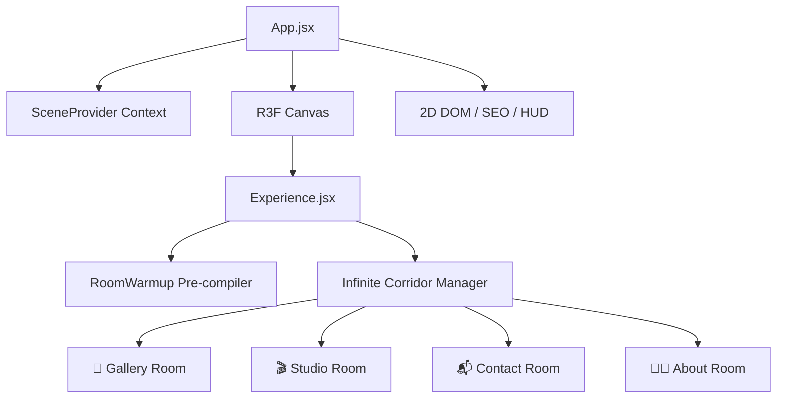

# 🎨 Sahil "S,ART" Aslam — Interactive 3D Portfolio

<div align="center">

  
  
  
  
  

  <br/><br/>

  **A fully immersive, hand-drawn 3D web portfolio built with React Three Fiber, GSAP & WebGL.**

  [Live Demo](https://sahilaslam.dev/) • [Instagram](https://www.instagram.com/i__am__aslam.1/) • [LinkedIn](https://www.linkedin.com/in/sahil-aslam-105640374/) • [GitHub](https://github.com/sahilaslam-art)

</div>

---

## ✨ What is this?

This isn't your average portfolio — it's a **fully explorable 3D world** rendered in the browser. Navigate through hand-drawn rooms, interact with 3D objects, and discover content across multiple immersive spaces.

> [!NOTE]
> Make sure **hardware acceleration** is enabled in your browser for the best 60 FPS experience.

---

## 🏠 The Rooms

| Room | Description |
|------|-------------|
| 🎨 **Gallery** | A balcony overlooking a city skyline — projects coming soon! |
| 🎬 **Studio** | A tower of interactive monitors, TVs & phones linking to my socials |
| 📬 **Contact** | Reach out through an interactive contact form |
| 🧑‍💻 **About** | Learn about my journey through a scrollable sky story |

Each room features:
- 🖌️ Hand-drawn **paint reveal** transition effects
- 🎵 **Spatial audio** that changes with each environment
- 🐦 Animated characters & floating elements
- 📱 Fully **responsive** — optimized for desktop & mobile

---

## 🚀 Tech Stack

| Technology | Purpose |
|-----------|---------|
| **React 19** | UI framework & component architecture |
| **Three.js** | 3D rendering engine |
| **React Three Fiber** | React renderer for Three.js |
| **@react-three/drei** | Helper components (Text, Float, Textures) |
| **GSAP 3** | Scroll-based & timeline animations |
| **Vite 7** | Lightning-fast dev server & bundler |

---

## 🏗️ Architecture



---

## ⚡ Performance Highlights

- **Async Shader Compilation** — Pre-compiles materials during loading to prevent jank
- **Baked Lighting** — Uses texture-based tinting instead of real-time shadow maps
- **DOM Mutation Bypassing** — Critical animations write directly to refs, skipping React re-renders
- **Adaptive Device Tiering** — Auto-scales resolution, antialiasing & texture quality based on hardware
- **SEO Fallback Layer** — Semantic HTML injected behind the canvas for search engine indexing

---

## 🛠️ Getting Started

### Prerequisites

- **Node.js** v20+
- **npm** v10+

### Installation

```bash
# Clone the repo
git clone https://github.com/sahilaslam-art/3d-gsap-porfolio.git
cd 3d-gsap-porfolio

# Install dependencies
npm install

# Start the dev server
npm run dev
```

> [!IMPORTANT]
> The first load may take a few seconds as hundreds of textures are served by the dev server. For production performance testing, run `npm run build && npm run preview`.

### Build for Production

```bash
npm run build
npm run preview
```

---

## 📂 Project Structure

```
src/
├── components/
│   ├── canvas/          # All 3D scene components
│   │   ├── corridor/    # Infinite corridor & door transitions
│   │   ├── entrance/    # Entry doors & hero text
│   │   └── rooms/       # Gallery, Studio, Contact, About
│   └── ui/              # 2D overlay UI (menus, popups, HUD)
├── context/             # React contexts (Scene, Audio, Achievements)
├── config/              # Texture preload lists & app config
└── main.jsx             # Entry point
```

---

## 🤝 Contributing

Contributions, issues, and feature requests are welcome!

1. Fork the project
2. Create your feature branch (`git checkout -b feature/cool-room`)
3. Commit your changes (`git commit -m 'feat: added new interactive room'`)
4. Push to the branch (`git push origin feature/cool-room`)
5. Open a Pull Request

---

## 📄 License

This project is open source and available for learning and inspiration.

---

<div align="center">

  **Designed & Developed with ❤️ by [Sahil Aslam](https://github.com/sahilaslam-art)**

  *"S,ART" — Where Code Meets Art.*

</div>
